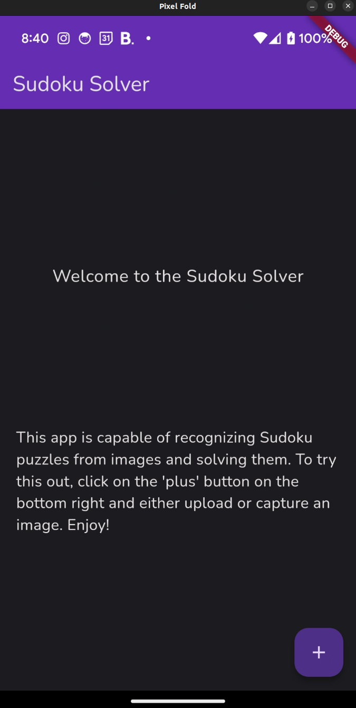
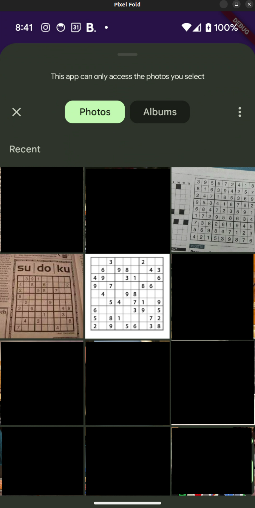
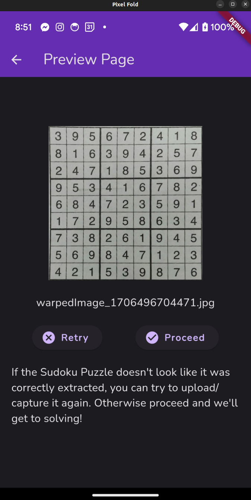

# Sudoku Detector

## Description

This is the implementation of a Sudoku solver that utilizes computer vision and machine learning techniques. The final goal of the project is to have a mobile application running in Flutter that is able to take an image of a Sudoku puzzle and solve it. The process can be view in the following steps:

1. Get the original image
2. Extract and transform the image to isolate the Sudoku puzzle from the rest of the image
3. Split the image by each cell and extract its number by sending the sub-image to a neural net classifier
4. Recreate the puzzle on the phone and solve it

This repository contains multiple directories that serve various purposes. The main ones are:

* /flutter_sudoku_app -- This directory containts the UI for the main mobile application.
* /native_opencv -- This directory containts the Flutter plugin code with the C++ implementation of the Sudoku solver. 
* /sudoku_solver_c_implementation -- Any C++ code that must be implemented on the Flutter application is first created and tested here before getting moved to the /native_opencv directory.
* /python_implementations -- Algorithms are first quickly implemented here in more detailed notebooks to quickly document and expirement with different techniques before following through with their implementation in C++. 

## Setup

### Flutter Setup

### CMake Setup

### Python Setup

## Preview

To show the progess thus far, below is an example of a puzzle being extracted from a gallery image on the Flutter application. 

Above is the main UI of the Flutter application. Clicking on the 'plus' button on the bottom right gives the option to upload or capture an image using the device's camera. 

Above shows the selection menu and a test sample of three images of Sudoku puzzles. The top right is being selected in this example. 

Above shows an image of the Sudoku puzzle that was extracted from the original image of the previous step. 